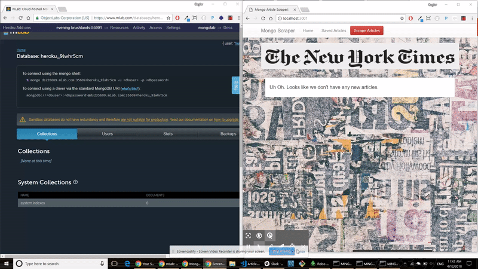

# Mongo-Scraper
A web app that lets users view and leave comments on the latest news. The purpose of this exercise is to improve my MongoDB, Mongoose, and Cheerio skills.

## A View From the App
[Click Me To Experience the Application](https://evening-brushlands-55991.herokuapp.com/)

## Technologies Used
 * MongoDB & Mongoose
 * JavaScript
 * jQuery
 * Node JS ( Please see packages.json file -> dependencies for NPM packages )
 * Bootsrap
 * Handlebars
 * Heroku

